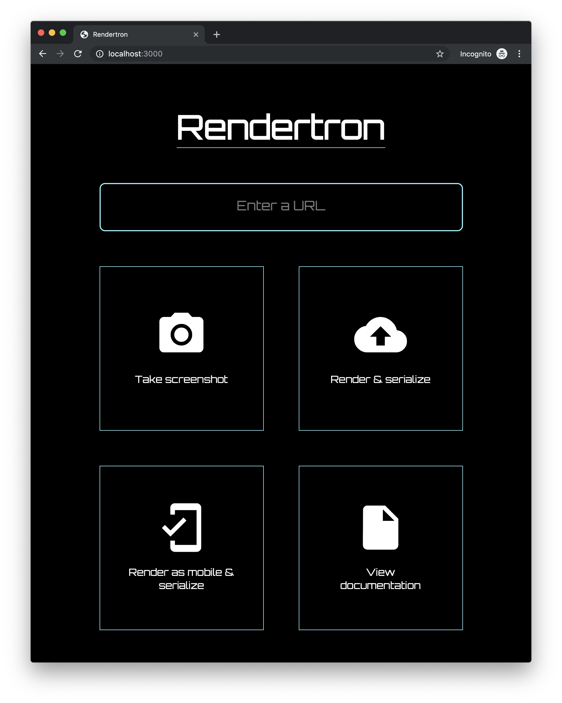

# Rendertron

Ready-to-use image for SSR rendering based on headless Chrome, [a.k.a Rendertron by Google](https://github.com/GoogleChrome/rendertron).

> All credits belong to authors of GoogleChrome/rendertron.

-----

[](https://hub.docker.com/r/dockette/rendertron/)
[](https://hub.docker.com/r/dockette/rendertron/)

## Discussion / Help

[](https://gitter.im/dockette/dockette?utm_source=badge&utm_medium=badge&utm_campaign=pr-badge&utm_content=badge)

## Usage

```
docker run -it --rm -p 3000:300 dockette/rendertron
```

